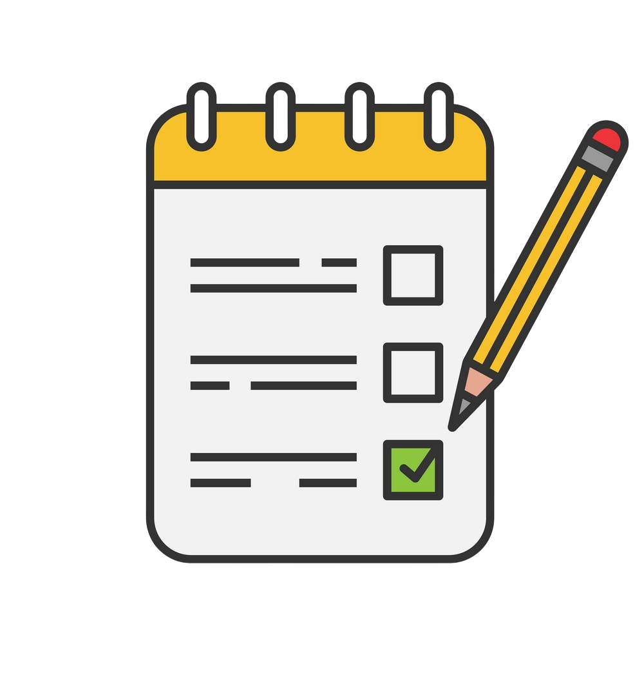

# ToDo List web-App

 <!-- You can replace this with a screenshot of your app -->

Welcome to the ToDo List Website App repository!  📝 This app allows you to manage your tasks effectively using a simple and intuitive interface.

## Features

- ✔️ Add new tasks to your list.
- ✅ Mark tasks as complete.
- ❌ Delete tasks you no longer need.
- 🔄 Reorder tasks to prioritize your work.
- 💾 Tasks are saved locally, so you never lose your progress.

## Demo

Check out the live demo of the app [here](https://yourappurl.com).

## Usage

1. Clone this repository.
2. Open the `index.html` file in your preferred web browser.
3. Start adding, completing, and managing your tasks!

## Screenshots

 <!-- You can add relevant screenshots here -->

## Technologies Used

- HTML
- CSS
- JavaScript

## Contributions

Contributions are welcome! If you'd like to make improvements, feel free to submit pull requests.

## Contact

Got questions or suggestions? Reach out to me on [Twitter](https://twitter.com/yourusername) or [LinkedIn](https://linkedin.com/in/yourusername).

Happy organizing! ✨
